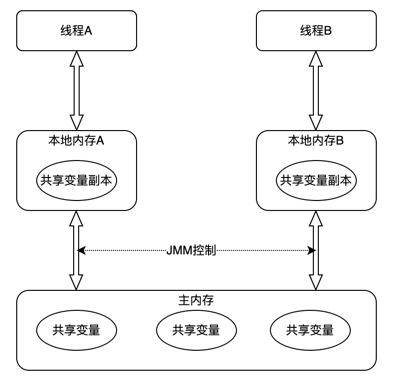

# 并发编程挑战
并发编程目的是让程序运行更快，但并不是启动更多线程就能让程序最大限度的并发执行。并发编程还面临着各种问题的挑战，比如上下文切换、死锁问题，
以及受限于硬件和软件的资源限制问题

## 上下文切换
在单核处理器上执行多线程代码时，CPU会给每个线程分配CPU时间片来执行这些线程。时间片非常短暂，一般几十毫秒，所以CPU需要不停的切换线程执行，
让人感觉这些线程是同时执行的

CPU通过时间片分配算法来循环执行任务，当前任务执行完一个时间片后会切换到下一个任务。在切换到下一个任务前会保存当前任务的状态，以便下次切换回
这个任务时，可以再加载这个任务状态。所以任务从保存到再加载的过程就是一次上下文切换。线程切换也会影响多线程的执行速度

### 如何减少上下文切换
我们知道上下文的切换需要时间会拖慢多线程的执行速度，并且在单核CPU上多线程的执行速度在小规模的数据量上会反而比单线程执行的慢，只有当数据量
达到一定规模后才会比单线程快。那么我们需要如何减少上下文切换呢？

减少上下文切换方法有无锁并发编程、CAS算法、使用最少线程和使用协程

- 无锁并发编程。多线程竞争锁时，会引起上下文切换，所以多线程处理数据时，可以用一些办法来避免使用锁，如将数据的ID按照Hash算法取模分段，不同线程
处理不同端的数据，或者说对数据做分片，不同线程负责不同分片数据处理
  
- CAS算法。Java的Atomic包使用CAS算法来更新数据，而不需要加锁

- 使用最少线程。避免创建不需要的线程，比如任务很少，但却创建了大量线程来处理，会造成大量线程都处于等待状态

- 协程：在单线程中实现多任务调度，并在单线程中维护多个任务间的切换。

## 死锁
锁在解决多线程对共享资源并发操作时使用广泛，但不正确的使用锁可能会带来风险。比如引起死锁，以下是一个可能会引起死锁的例子。线程t1、t2互相持有
对方需要的锁，导致两个线程都在等待对方释放锁
```
package org.aim.lock;

public class DeadLockDemo {
    private static String A = "A";
    private static String B= "B";

    public static void main(String[] args){
        new DeadLockDemo().deadLock();
    }

    private void deadLock(){
        Thread t1 = new Thread(new Runnable() {
            @Override
            public void run() {
                synchronized (A){
                    try {
                        Thread.currentThread().sleep(20000);
                    } catch (InterruptedException e) {
                        e.printStackTrace();
                    }
                    synchronized (B){
                        System.out.println("1");
                    }
                }
            }
        });

        Thread t2 = new Thread(new Runnable() {
            @Override
            public void run() {
                synchronized (B){
                    synchronized (A){
                        System.out.println("2");
                    }
                }
            }
        });

        t1.start();
        t2.start();
    }
}
```
通过jdk自带的jconsole工具我们可以监控到死锁线程


上面只是演示死锁的demo，正常情况下我们并不会这样写。但在某些复杂场景下，可能因为一些异常情况没有释放锁，或者在释放锁时发生了异常，导致没有释放
掉。而其他线程可能永远都得不到锁进入阻塞状态。一旦出现死锁，业务将无法进行，我们可以通过监控工具查看具体是哪些线程发生死锁，比如使用jconsole
jdk自带的监控工具。也可以使用[其它工具](https://blog.csdn.net/github_38730134/article/details/121194952)

我们要如何避免死锁？

- 避免一个线程同时获取多个锁

- 避免一个线程在锁内同时占用多个资源，尽量保证每个锁只占用一个资源

- 尝试使用定时锁，使用lock.tryLock(timeout)来替代使用内部锁机制

- 对于数据库锁，加锁和解锁必须在一个数据库连接里，否则会出现解锁失败情况

## 资源限制

### 什么是资源限制
资源限制指进行并发编程时，程序的执行速度受限于硬件、软件资源。硬件资源限制有带宽的上传/下载速度、硬盘读写速度和CPU的处理速度。软件资源限制有
数据库连接数和socket连接数等

### 资源限制引发的问题
我们将代码串行执行部分改为并发执行，加快执行速度，但如果受限于资源，仍然是在串行执行，这不但不会加快速度，反而会拖慢执行速度，因为上下文切换
和资源调度会额外消耗时间。例如在单核CPU上开启多个线程并发执行，只是伪并发

### 解决资源限制问题
对于单机资源有限制，可以考虑多机上运行。比如使用hadoop等将多机组成一个集群，在集群中执行程序，不同的机器处理不同的数据

对于软件限制可以考虑使用资源池复用资源。比如使用连接池将数据库和Socket连接复用

### 资源限制下进行并发编程
根据不同的资源限制调整程序并发度，比如文件下载依赖于带宽和硬盘读写速度。有数据库操作时，涉及到数据库连接数


